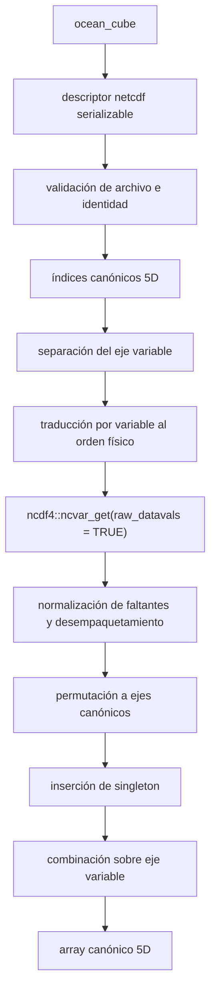

# Contrato arquitectónico del backend NetCDF de `oceancube`

## 1. Propósito y estado

Este documento define el contrato recomendado para representar un archivo
NetCDF local como un `ocean_cube` sin materializar todas sus variables en
memoria. Es una especificación para un hito posterior: no constituye una
implementación.

Estado del documento:

- backend existente: `memory`;
- backend diseñado: `netcdf`;
- modo inicial de NetCDF: local y de solo lectura;
- orden lógico invariable:
  `longitude × latitude × depth × time × variable`;
- conexión persistente dentro del objeto: prohibida;
- lectura NetCDF diferida: pendiente de implementación.

El principio rector es:

> Los algoritmos conocen el contrato canónico del cubo; el backend conoce el
> orden físico, el archivo y la forma de obtener los valores.

## 2. Conceptos

### 2.1 Archivo, conexión y backend

Un archivo NetCDF es un recurso persistente. Puede almacenar variables con
tipos, compresión, empaquetamiento y órdenes dimensionales distintos.

Una conexión `ncdf4` es un recurso temporal asociado con una sesión y un
descriptor nativo. No es el archivo ni el backend.

El backend es el contrato que:

1. identifica el recurso;
2. valida su esquema;
3. traduce índices canónicos;
4. abre y cierra conexiones;
5. decodifica valores;
6. devuelve arrays canónicos.

### 2.2 Dimensión física y eje lógico

Una dimensión física pertenece al archivo y a cada variable. Por ejemplo:

```text
temperature: lon × lat × depth × time
oxygen:      time × depth × lat × lon
sst:         lon × lat × time
```

Los ejes lógicos de `ocean_cube` son siempre:

```text
longitude × latitude × depth × time × variable
```

El eje lógico `variable` agrupa objetos NetCDF separados. No debe suponerse que
existe como dimensión física.

### 2.3 Lectura diferida y procesamiento lazy

La lectura diferida evita cargar valores hasta una llamada de lectura. No hace
que un algoritmo sea completamente lazy. Una función que solicite el cubo
completo seguirá materializando un array completo.

## 3. Evidencia del código actual

`read_nc()` actualmente:

1. comprueba que el archivo exista;
2. abre una conexión con `ncdf4::nc_open()`;
3. registra `nc_close()` mediante `on.exit()`;
4. reconoce dimensiones únicamente por argumentos o nombres conocidos;
5. lee longitude, latitude, time y depth;
6. lee completamente cada variable mediante `ncvar_get()`;
7. usa `aperm()` para llevarla al orden esperado;
8. inserta las variables en un array 5D completo;
9. construye un backend `memory`.

Aspectos reutilizables:

- ciclo abrir/`on.exit(close)`;
- argumentos explícitos para dimensiones;
- validadores de índices y bloques canónicos;
- orden final 5D;
- conversión explícita de tiempo como punto de partida;
- selección explícita y ordenada de variables.

Aspectos incompatibles con lectura diferida:

- asignación anticipada del array completo;
- lectura completa por variable;
- ausencia de un descriptor serializable;
- detección de dimensiones solo por nombres;
- descarte del orden físico después de `aperm()`;
- conservación limitada de atributos;
- combinación implícita de superficie con el primer nivel de profundidad;
- conversión insegura de calendarios no gregorianos.

Información que actualmente se pierde:

- ruta normalizada, tamaño y modificación del archivo;
- valores temporales crudos;
- atributos CF completos;
- tipo físico de cada variable;
- `_FillValue`, `missing_value`, `scale_factor` y `add_offset`;
- nombres y orden físico de dimensiones por variable;
- variables de coordenada usadas por cada variable de datos;
- tolerancias y decisiones de compatibilidad.

## 4. Diagnóstico reproducible de `ncdf4`

El script `dev/diagnostics/netcdf_backend_contract.R` genera un NetCDF en
`tempdir()` con cuatro variables:

| Variable | Dimensiones fuente | Tipo | Propósito |
|---|---|---|---|
| `temperature` | `lon × lat × depth × time` | `short` empaquetado | Orden canónico y atributos de empaquetamiento |
| `oxygen` | `time × depth × lat × lon` | `double` | Orden físico inverso |
| `sst` | `lon × lat × time` | `float` | Variable superficial |
| `chlorophyll` | `lon × lat_chlorophyll × time` | `float` | Grilla incompatible |

Resultados empíricos:

- `ncvar_get()` conserva el orden físico de cada variable;
- `start` y `count` se expresan en ese orden físico;
- `collapse_degen = FALSE` conserva dimensiones de longitud uno;
- `raw_datavals = TRUE` devuelve valores empaquetados sin escala;
- la lectura normal aplicó `scale_factor` y `add_offset`;
- cuando `_FillValue` y `missing_value` fueron diferentes, `ncdf4` convirtió
  `missing_value` en `NA`, pero escaló `_FillValue` como si fuera un dato;
- las conexiones pudieron abrirse y cerrarse repetidamente;
- el archivo temporal se eliminó después del diagnóstico.

Esta diferencia entre `_FillValue` y `missing_value` justifica una decodificación
explícita del backend sobre valores crudos.

## 5. Alcance inicial

### 5.1 Soportado inicialmente

- archivos NetCDF locales;
- acceso de solo lectura;
- grillas rectilíneas;
- longitude y latitude unidimensionales;
- una dimensión temporal compartida;
- profundidad unidimensional compartida o cubo enteramente superficial;
- múltiples variables con coordenadas compatibles;
- lectura completa, indexada y por bloques;
- índices no contiguos mediante envolvente mínima;
- salida canónica de cinco dimensiones;
- calendarios convertibles con seguridad a la representación temporal actual.

### 5.2 No soportado inicialmente

`NO SOPORTADO INICIALMENTE` no significa imposible. Significa que requiere otro
contrato o implementación:

- OPeNDAP y THREDDS;
- grillas curvilíneas 2D;
- grillas no estructuradas;
- variables escalonadas;
- mallas UGRID;
- escritura NetCDF;
- modificación in situ;
- calendarios no convertibles con exactitud;
- variables con grillas incompatibles;
- mezcla implícita de variables superficiales y tridimensionales;
- procesamiento paralelo o distribuido;
- caché de conexiones;
- remuestreo, interpolación o reproyección.

## 6. Alternativas de representación

### 6.1 Alternativa A: componentes en el nivel principal

```r
x$backend
x$file
x$dimension_map
x$variable_map
```

Ventajas:

- acceso directo;
- implementación inicial sencilla.

Desventajas:

- colisiona con metadatos científicos;
- ensancha el contrato público de lista;
- dificulta versionar el descriptor;
- mezcla almacenamiento y contenido lógico.

### 6.2 Alternativa B: descriptor agrupado

```r
x$storage <- list(
  version = 1L,
  backend = "netcdf",
  ...
)
```

Ventajas:

- agrupa detalles técnicos;
- es serializable;
- admite validación y versionado;
- facilita despacho;
- reduce colisiones;
- permite añadir otro backend sin poblar el nivel principal.

Desventajas:

- exige que `.cube_backend()` reconozca el descriptor;
- requiere migración cuidadosa del despacho interno.

### 6.3 Alternativa C: clase adicional

```r
class(x) <- c("ocean_cube_netcdf", "ocean_cube", "list")
```

Ventajas:

- facilita despacho S3;
- hace visible el backend mediante clase.

Desventajas:

- la clase no contiene el esquema necesario;
- puede crear diferencias públicas innecesarias;
- no sustituye un descriptor;
- multiplica métodos antes de necesitarlos.

### 6.4 Recomendación

Usar la alternativa B. Mantener inicialmente la clase pública
`c("ocean_cube", "list")`. Una clase adicional podría añadirse después si existe
una necesidad real de despacho S3, pero no debe ser la fuente de verdad del
backend.

El backend `memory` conserva su representación actual durante la primera
implementación NetCDF.

## 7. Descriptor mínimo recomendado

Esquema conceptual:

```r
storage <- list(
  version = 1L,
  backend = "netcdf",
  read_only = TRUE,
  file = list(...),
  dimensions = list(...),
  variables = list(...),
  time = list(...),
  decoding = list(...),
  options = list(...)
)
```

### 7.1 Campos de nivel superior

| Campo | Tipo | Obligatorio | Significado | Validación |
|---|---|---:|---|---|
| `version` | entero escalar | Sí | Versión del descriptor | Igual a una versión soportada |
| `backend` | carácter escalar | Sí | Identidad del backend | Exactamente `"netcdf"` |
| `read_only` | lógico escalar | Sí | Política de escritura | `TRUE` inicialmente |
| `file` | lista | Sí | Identidad del archivo | Esquema de archivo válido |
| `dimensions` | lista nombrada | Sí | Mapa físico y canónico | Ejes resolubles y únicos |
| `variables` | lista | Sí | Orden lógico y mapas por variable | Nombres únicos y compatibles |
| `time` | lista | Sí | Tiempo crudo y decodificado | Estado coherente |
| `decoding` | lista | Sí | Política de faltantes/empaquetamiento | Valores escalares válidos |
| `options` | lista | Sí | Decisiones internas congeladas | Valores admitidos |

### 7.2 Identidad del archivo

| Campo | Tipo | Obligatorio | Significado | Validación |
|---|---|---:|---|---|
| `path` | carácter escalar | Sí | Ruta proporcionada | No vacía |
| `normalized_path` | carácter escalar | Sí | Ruta absoluta normalizada | Archivo local |
| `size_bytes` | double entero | Sí | Tamaño al construir | Finito y no negativo |
| `modified_utc` | `POSIXct` | Sí | Modificación al construir | No ausente |
| `identity_policy` | carácter | Sí | Política de cambio | Inicialmente `"size_mtime_error"` |

No se almacena un hash completo por defecto.

### 7.3 Dimensiones

`dimensions$canonical` contiene una entrada por eje:

| Campo | Tipo | Significado |
|---|---|---|
| `axis` | carácter | `longitude`, `latitude`, `depth` o `time` |
| `source_dimension` | carácter | Nombre físico |
| `coordinate_variable` | carácter | Variable de coordenada |
| `length` | entero | Longitud lógica |
| `source_type` | carácter | Tipo NetCDF |
| `units` | carácter o `NA` | Unidades fuente |
| `standard_name` | carácter o `NA` | Atributo CF |
| `axis_attribute` | carácter o `NA` | `X`, `Y`, `Z` o `T` |
| `positive` | carácter o `NA` | Dirección vertical |
| `calendar` | carácter o `NA` | Calendario temporal |
| `detection` | lista | Regla y evidencia usada |

Los valores lógicos de longitude, latitude, depth y time permanecen también en
los componentes canónicos existentes del `ocean_cube`.

### 7.4 Variables

`variables$order` contiene el orden del eje lógico `variable`.

`variables$map[[logical_name]]` contiene:

| Campo | Tipo | Obligatorio | Significado |
|---|---|---:|---|
| `logical_name` | carácter | Sí | Nombre en `x$vars` |
| `source_name` | carácter | Sí | Nombre en NetCDF |
| `source_dimension_names` | carácter | Sí | Orden físico |
| `source_dimension_lengths` | entero | Sí | Longitudes físicas |
| `canonical_axes` | carácter | Sí | Ejes representados |
| `source_to_canonical_permutation` | entero | Sí | Vector para `aperm()` |
| `canonical_to_source_permutation` | entero | Sí | Traducción de bloques |
| `singleton_axes_inserted` | carácter | Sí | Ejes lógicos ausentes |
| `coordinate_variables` | lista | Sí | Coordenada por eje |
| `source_type` | carácter | Sí | Tipo NetCDF |
| `fill_value` | numérico o `NA` | Sí | `_FillValue` fuente |
| `missing_value` | numérico o `NA` | Sí | `missing_value` fuente |
| `scale_factor` | numérico | Sí | Escala; 1 si ausente |
| `add_offset` | numérico | Sí | Offset; 0 si ausente |
| `units` | carácter o `NA` | Sí | Unidades |
| `long_name` | carácter o `NA` | Sí | Descripción |
| `standard_name` | carácter o `NA` | Sí | Nombre CF |
| `attributes` | lista serializable | Sí | Atributos conservados |

El descriptor no contiene:

- conexiones abiertas;
- external pointers;
- arrays completos de variables de datos;
- credenciales;
- objetos dependientes de una sesión.

Los vectores de coordenadas y el tiempo crudo sí pueden conservarse porque son
parte del encabezado lógico, no el array oceanográfico completo.

## 8. Ciclo de vida de conexiones

Política:

```r
nc <- ncdf4::nc_open(path)
on.exit(ncdf4::nc_close(nc), add = TRUE)
```

Cada operación pública del backend abre una conexión, realiza todas sus lecturas
relacionadas y la cierra. Una lectura de varias variables debe compartir la
misma conexión durante esa operación.

Ventajas:

- serialización segura;
- cierre ante errores;
- objetos válidos después de reiniciar R;
- menor riesgo de descriptores obsoletos;
- reproducibilidad entre sesiones.

Costos:

- latencia de aperturas repetidas;
- nueva validación básica por operación;
- posible necesidad futura de caché.

No se implementa caché inicial ni se almacena la conexión en `x$storage`.

## 9. Identidad y mutación del archivo

### 9.1 Alternativas

**A. Solo existencia:** barata, pero no detecta sustituciones.

**B. Ruta normalizada, tamaño y modificación:** costo bajo, detecta cambios
comunes y es adecuada para archivos grandes.

**C. Hash completo:** fuerte, pero obliga a leer todo el archivo y puede ser
prohibitivo.

### 9.2 Recomendación

Usar B. Antes de cada operación:

1. verificar existencia;
2. normalizar la ruta;
3. comparar tamaño;
4. comparar modificación.

Un cambio produce error por defecto:

```text
NetCDF source changed after the ocean_cube descriptor was created:
expected size ... and modified time ...; found ...
Reopen the file to refresh its schema.
```

No se continúa con warning porque las dimensiones o el empaquetamiento podrían
haber cambiado. Una futura opción explícita podrá reconstruir el descriptor,
pero no debe reutilizarlo silenciosamente.

El hash completo queda como verificación opcional futura, nunca automática.

## 10. Contrato de coordenadas

### 10.1 Longitude

- vector 1D;
- admite `[-180, 180]` o `[0, 360]`;
- conserva orden y convención;
- no convierte ni ordena automáticamente.

### 10.2 Latitude

- vector 1D;
- admite orden ascendente o descendente;
- conserva duplicados solo si el contrato general vigente los admite;
- no invierte automáticamente.

### 10.3 Depth

- vector 1D compartido; o
- `NA_real_` singleton cuando todas las variables seleccionadas son
  superficiales.

Se conservan `units`, `positive`, `standard_name` y `axis`. El signo no se
interpreta sin esos atributos.

### 10.4 Time

Se conservan:

```text
raw_values
units
calendar
origin
decoded_values
decode_status
```

No se ordena. El orden físico es el orden lógico.

## 11. Detección de dimensiones

Jerarquía:

1. argumentos explícitos del futuro constructor;
2. atributos `axis`, `standard_name`, `units`, `positive`, `calendar`;
3. nombres conocidos;
4. error informativo.

Nombres auxiliares iniciales:

| Eje | Nombres |
|---|---|
| longitude | `lon`, `longitude`, `x` |
| latitude | `lat`, `latitude`, `y` |
| depth | `depth`, `deptht`, `lev`, `level`, `z` |
| time | `time`, `t` |

No se elige el primer candidato cuando hay ambigüedad.

Ejemplo:

```text
Cannot resolve the longitude dimension.
Candidates: x1 (axis=X), longitude_aux (standard_name=longitude).
Specify the longitude dimension explicitly.
```

El descriptor registra la regla y evidencia utilizadas.

## 12. Mapeo físico a canónico

Definiciones:

- `source_to_canonical_permutation` es el vector que se pasa a `aperm()` para
  ordenar los ejes físicos presentes como ejes canónicos presentes;
- `canonical_to_source_permutation` ordena `start/count` canónicos presentes
  según el orden físico;
- `singleton_axes_inserted` enumera ejes lógicos ausentes físicamente.

| Variable fixture | Dimensiones fuente | Dimensiones canónicas | Permutación para `aperm()` | Compatible |
|---|---|---|---|---:|
| `temperature` | `lon,lat,depth,time` | `lon,lat,depth,time,var` | `1,2,3,4` | Sí |
| `oxygen` | `time,depth,lat,lon` | `lon,lat,depth,time,var` | `4,3,2,1` | Sí |
| `sst` | `lon,lat,time` | `lon,lat,1,time,var` | `1,2,3`, insertar depth | Solo en cubo superficial |
| `chlorophyll` | `lon,lat_chlorophyll,time` | No combinable | No aplica | No |

Ejemplo `oxygen`:

```text
fuente:     time × depth × latitude × longitude
aperm:      c(4, 3, 2, 1)
resultado:  longitude × latitude × depth × time
insertar:   variable singleton
final:      longitude × latitude × depth × time × variable
```

No se confía en `dimnames`; el mapa se almacena y valida contra el archivo.

## 13. Eje lógico `variable`

Para las variables solicitadas, en el orden solicitado:

1. localizar el objeto NetCDF fuente;
2. traducir la selección canónica;
3. leer valores crudos;
4. normalizar faltantes y decodificar;
5. permutar a cuatro ejes canónicos;
6. insertar ejes singleton;
7. combinar sobre el quinto eje.

La longitud del quinto eje es `length(x$vars)`. Una selección no contigua o
reordenada de variables se resuelve iterando esos objetos en el orden pedido.

## 14. Variables superficiales

Política inicial:

- si todas las variables son superficiales, crear un cubo con
  `depth = NA_real_` y longitud vertical uno;
- si todas comparten el mismo eje vertical explícito, combinarlas;
- si se mezclan variables sin depth y variables con varios niveles, rechazar la
  combinación y recomendar cubos separados.

No se expande una variable superficial al primer nivel ni se rellenan niveles
profundos implícitamente. Ambas decisiones introducirían una interpretación
científica no declarada.

Mensaje:

```text
Variables cannot share one ocean_cube because their vertical axes are
incompatible: `temperature` uses depth [0, 50], while `sst` has no depth axis.
Open them as separate cubes.
```

## 15. Compatibilidad entre variables

Antes de combinarlas se comprueba:

- mismo eje longitude;
- mismo eje latitude;
- mismo tiempo crudo, unidades y calendario;
- profundidad compatible;
- correspondencia única entre dimensiones físicas y ejes;
- valores de coordenadas equivalentes;
- orden lógico preservable.

No basta con longitudes iguales.

Si dos variables usan la misma variable de coordenada, la identidad es directa.
Si usan variables distintas:

- `double`: tolerancia relativa
  `64 * .Machine$double.eps * max(1, abs(a), abs(b))`;
- `float`: tolerancia relativa
  `8 * .Machine$single.eps * max(1, abs(a), abs(b))`.

La tolerancia usada se registra. Tiempo, calendario y profundidad semánticamente
distinta no se aproximan. No se remuestrea, interpola ni reproyecta.

## 16. Tiempo y calendarios

### 16.1 Compatible inicialmente

- `gregorian`;
- `standard`;
- `proleptic_gregorian`;

solo cuando las unidades siguen
`seconds|minutes|hours|days since <origin>` y la conversión a la representación
temporal actual es segura para el intervalo.

### 16.2 No convertible silenciosamente

- `360_day`;
- `365_day`;
- `noleap`;
- `366_day`;
- `all_leap`;
- otros calendarios no gregorianos.

La primera implementación produce error informativo y no crea un `ocean_cube`
con fechas falsas:

```text
Calendar `360_day` cannot be represented safely as R Date.
The raw time axis and units were inspected, but this backend version does not
support a specialized calendar class.
```

Una clase temporal especializada queda pendiente. El descriptor preliminar de
inspección conserva valores crudos, unidades, calendario, origen,
`decoded_values` y `decode_status`.

La conducta actual de `.read_cf_time()` —warning y tratamiento gregoriano— no es
aceptable para el backend diferido.

## 17. Faltantes y empaquetamiento

### 17.1 Evidencia

| Atributo | Valor fixture | Comportamiento de `ncdf4` | Contrato futuro |
|---|---:|---|---|
| `_FillValue` | `-32767` | Con `missing_value` distinto fue escalado a `-3266.7` | Convertir a `NA` antes de escalar |
| `missing_value` | `-32766` | Se convirtió en `NA` | Convertir también a `NA` |
| `scale_factor` | `0.1` | Aplicado automáticamente en lectura normal | Aplicar una vez sobre crudos |
| `add_offset` | `10` | Aplicado automáticamente en lectura normal | Aplicar una vez sobre crudos |
| `units` | `degree_Celsius` | Disponible como atributo | Conservar |
| `long_name` | texto fixture | Disponible | Conservar |
| `standard_name` | nombre CF | Disponible | Conservar |

### 17.2 Contrato

El backend inicial usa `raw_datavals = TRUE` y:

1. obtiene tipo fuente y valores crudos;
2. identifica `_FillValue` y `missing_value`;
3. marca ambos como `NA` en el dominio empaquetado;
4. convierte los demás valores a un tipo R adecuado;
5. aplica `decoded = packed * scale_factor + add_offset` exactamente una vez;
6. devuelve valores físicos.

Las funciones científicas reciben valores físicos y `NA`.

Se conservan tipo fuente, centinelas, escala, offset, unidades y atributos. No
se delega ambiguamente la elección entre dos centinelas a `ncdf4`.

## 18. Lectura completa

Contrato futuro de:

```r
.cube_read(x, index = NULL)
```

1. validar descriptor e identidad del archivo;
2. abrir una conexión;
3. leer cada variable solicitada;
4. decodificar;
5. permutar;
6. insertar singleton;
7. combinar;
8. adjuntar dimensiones y dimnames canónicos;
9. cerrar la conexión;
10. devolver un array 5D sin modificar `x`.

Resultado:

```text
dim = c(nlon, nlat, ndepth, ntime, nvariable)
names(dim) = longitude, latitude, depth, time, variable
```

Los dimnames proceden de las coordenadas lógicas y respetan el orden solicitado.

Una lectura completa puede agotar memoria. La futura implementación debe
calcular el tamaño estimado y podrá advertir, sin cambiar inicialmente la firma
pública.

## 19. Lectura por bloques

`start` y `count` siguen expresándose en orden canónico 5D.

Proceso:

1. validar bloque contra `.cube_shape(x)`;
2. separar selección del eje `variable`;
3. tomar los cuatro ejes canónicos de cada variable;
4. eliminar el eje singleton ausente, si corresponde;
5. permutar `start/count` al orden físico;
6. ejecutar `ncvar_get(raw_datavals = TRUE, collapse_degen = FALSE)`;
7. decodificar;
8. aplicar `aperm()`;
9. insertar singleton;
10. combinar variables.

Ejemplo para `oxygen`, almacenado
`time × depth × latitude × longitude`:

```text
start canónico:
longitude=2, latitude=1, depth=1, time=2, variable=1

count canónico:
longitude=2, latitude=2, depth=1, time=2, variable=1

start fuente:
time=2, depth=1, latitude=1, longitude=2
=> c(2, 1, 1, 2)

count fuente:
time=2, depth=1, latitude=2, longitude=2
=> c(2, 1, 2, 2)

dim leída:
2 × 1 × 2 × 2

aperm c(4,3,2,1):
2 × 2 × 1 × 2

dim final:
2 × 2 × 1 × 2 × 1
```

## 20. Índices no contiguos

La interfaz de `.cube_read(index=...)` ya permite orden arbitrario, duplicados e
índices no contiguos.

### Alternativas

- **A. Rechazar:** rompe equivalencia entre backends.
- **B. Envolvente mínima:** una lectura rectangular y subindexación local.
- **C. Varias lecturas:** menos sobrelectura, más llamadas.
- **D. Planificador:** eficiente, demasiado complejo inicialmente.

### Recomendación

Usar B:

```text
solicitud longitude = c(1, 3), time = c(1, 4)
leer longitude = 1:3, time = 1:4
retener localmente c(1, 3) y c(1, 4)
```

Después de permutar a canónico se aplican índices relativos que preservan orden
y duplicados. El eje variable se resuelve por objetos fuente en el orden
solicitado.

Costo: puede sobreleer una envolvente grande. El descriptor de la operación
debe registrar celdas solicitadas y leídas. Un planificador queda pendiente.

## 21. Escritura

El backend inicial es `READ ONLY`.

`.cube_write_block()` sobre NetCDF debe fallar:

```text
NetCDF backend is read-only.
Collect the cube into memory before modifying values.
```

No modifica el archivo, no crea una copia y no materializa silenciosamente un
backend `memory`.

## 22. Recolección futura

Una futura `cube_collect(x)`:

1. estima memoria;
2. lee el array 5D;
3. construye un backend `memory`;
4. conserva coordenadas, variables, unidades y metadatos;
5. registra archivo y selección en procedencia;
6. permite escrituras posteriores sobre el objeto en memoria.

Si `x` ya es `memory`, la recomendación es devolverlo sin cambios, preservando
identidad observable cuando sea seguro. No se implementa en este hito.

## 23. Procedencia

### 23.1 Metadatos del producto

- `source`;
- `dataset_id`;
- unidades;
- `standard_name`;
- `long_name`;
- atributos CF;
- coordenadas y calendario.

### 23.2 Procedencia de `oceancube`

- ruta normalizada no sensible;
- variables fuente y orden solicitado;
- nombres físicos de dimensiones;
- identidad de archivo observada;
- fecha de construcción lógica;
- backend;
- selección inicial;
- reglas de detección;
- operaciones posteriores.

No se guardan credenciales, tokens, URLs firmadas ni conexiones.

## 24. Validación lógica y física

### 24.1 Validación lógica

No abre el archivo ni lee valores:

- clase `ocean_cube`;
- coordenadas;
- variables;
- forma canónica declarada;
- presencia y versión del descriptor;
- `backend == "netcdf"`;
- coherencia interna de mapas.

Clases de error propuestas:

```text
oceancube_bad_cube
oceancube_bad_storage
```

### 24.2 Validación física

Abre el archivo, pero no carga arrays completos:

- existe y es abrible;
- identidad no cambió;
- dimensiones existen;
- variables existen;
- coordenadas son compatibles;
- órdenes y longitudes coinciden con el descriptor;
- atributos críticos no cambiaron;
- mapeos son permutaciones válidas.

Clases propuestas:

```text
oceancube_netcdf_file_error
oceancube_netcdf_schema_error
oceancube_netcdf_changed_file
```

## 25. Estimación de tamaño

Helper futuro, no implementado:

```r
.cube_estimated_bytes(x)
```

Fórmula:

```text
B = nlon × nlat × ndepth × ntime × nvariable × bytes_por_elemento_R
```

Para salida `double`, `bytes_por_elemento_R = 8`, sin contar cabeceras ni
dimnames.

El tamaño lógico:

- no es el tamaño comprimido del NetCDF;
- no es la suma de tipos fuente;
- puede ser mayor porque un `short` de 2 bytes se convierte a `double` de 8;
- sirve para advertir antes de lectura completa o `cube_collect()`.

## 26. Errores diseñados

Los mensajes deben explicar hecho, expectativa, hallazgo y corrección.

| Caso | Mensaje conceptual |
|---|---|
| Archivo inexistente | `NetCDF file does not exist: <path>. Reopen with a valid local path.` |
| No abrible | `Cannot open NetCDF file <path>: <ncdf4 error>.` |
| Dimensión no reconocida | `Cannot resolve the time dimension. Specify it explicitly.` |
| Dimensión ambigua | `Multiple latitude candidates were found: ...` |
| Variable inexistente | `Variable 'x' is not present. Available data variables: ...` |
| Variables incompatibles | `Variables cannot share one ocean_cube because their latitude coordinates differ.` |
| Calendario no soportado | `Calendar '360_day' cannot be represented safely as R Date.` |
| Grilla curvilínea | `Longitude coordinate is 2D; the initial backend requires a 1D rectilinear grid.` |
| Bloque fuera de límites | Reutilizar mensaje canónico con eje, fin y tamaño |
| Solo lectura | `NetCDF backend is read-only. Collect the cube into memory before modifying values.` |
| Archivo modificado | Mostrar identidad esperada y encontrada; pedir reapertura |
| Tiempo sin unidades | `Time coordinate has no '<unit> since <origin>' units attribute.` |
| Variable sin unidades | Warning de metadatos; conservar `NA`, no impedir lectura por defecto |
| Profundidad incompatible | Mostrar variables y ejes verticales; recomendar cubos separados |

Una variable sin unidades es legible, pero se marca en QA/procedencia. Un tiempo
sin unidades necesarias para decodificar es error.

## 27. Relación futura con `read_nc()`

### Alternativas

**A. `read_nc()` continúa materializando memoria.** Máxima compatibilidad.

**B. `read_nc()` cambia a NetCDF diferido.** Rompe expectativas de clase,
serialización y rendimiento.

**C. `read_nc()` permanece igual y se añade una función explícita de apertura.**
Clara y compatible.

**D. Añadir `backend=` a `read_nc()`.** Conserva default si se hace bien, pero
ensancha una API ya pública y mezcla dos verbos.

### Recomendación

Elegir C:

- `read_nc()` conserva firma y devuelve backend `memory`;
- una futura función explícita, cuyo nombre debe aprobarse (`open_nc()` o
  `cube_open()`), construye el descriptor NetCDF sin cargar datos;
- ambas rutas pueden reutilizar resolución de esquema y decodificación.

No se modifica `read_nc()` en este hito.

## 28. API interna futura mínima

Nombres propuestos, no implementados:

| Helper | Responsabilidad | Entrada | Salida |
|---|---|---|---|
| `.new_netcdf_storage()` | Construir descriptor serializable | ruta, variables, mapas, opciones | lista `storage` |
| `.validate_netcdf_storage()` | Validar esquema lógico del descriptor | `storage`, cabecera del cubo | invisible `TRUE` |
| `.with_netcdf_connection()` | Abrir, ejecutar y cerrar con seguridad | ruta, callback | resultado del callback |
| `.resolve_netcdf_schema()` | Resolver dimensiones, coordenadas y variables | conexión, argumentos explícitos | mapas validados |
| `.translate_netcdf_block()` | Traducir start/count canónicos | mapa de variable, bloque | start/count fuente |
| `.decode_netcdf_values()` | Normalizar faltantes y desempaquetar | array crudo, metadatos | array físico |
| `.permute_to_canonical()` | Permutar e insertar singleton | array, mapa | array canónico 4D |

La lectura de una variable puede permanecer como cuerpo privado del dispatcher
hasta que exista duplicación real. No se crean helpers por cada paso
prematuramente.

## 29. Matriz de decisiones

| Decisión | Alternativas | Recomendación | Motivo | Impacto | Estado |
|---|---|---|---|---|---|
| Descriptor | Nivel principal, agrupado, clase | `x$storage` agrupado | Serialización y extensibilidad | Nuevo contrato interno | RECOMENDADA |
| Clase adicional | Sí/no | No inicialmente | Descriptor basta | Menor cambio público | RECOMENDADA |
| Conexión persistente | Sí/no | No | Evita punteros inválidos | Apertura por operación | ACORDADA |
| Modo | Lectura/escritura | Solo lectura | Seguridad | Escritura falla | ACORDADA |
| Recursos | Local/remoto | Local | Alcance controlable | OPeNDAP fuera | ACORDADA |
| Grilla | Rectilínea/curvilínea | Rectilínea 1D | Contrato actual | Curvilínea fuera | ACORDADA |
| Variables incompatibles | Rechazar/remuestrear | Rechazar | Exactitud | Cubos separados | ACORDADA |
| Superficie + profundidad | Expandir/rechazar | Rechazar mezcla | Sin inferencia científica | Cubos separados | RECOMENDADA |
| Calendario no estándar | Forzar Date/error/clase | Error inicial | Exactitud temporal | Clase futura | RECOMENDADA |
| No contiguos | Rechazar/envolvente/múltiple | Envolvente mínima | Equivalencia de interfaz | Posible sobrelectura | RECOMENDADA |
| Archivo cambiado | Permitir/warning/error | Error | Reproducibilidad | Reabrir descriptor | RECOMENDADA |
| Identidad | Existencia/mtime+size/hash | Ruta+size+mtime | Costo razonable | Hash opcional futuro | RECOMENDADA |
| Lectura completa | Permitir/prohibir | Permitir con estimación | Compatibilidad | Riesgo de memoria | RECOMENDADA |
| Escritura | In situ/copia/error | Error read-only | No alterar fuente | Requiere collect | ACORDADA |
| Procedencia | Mínima/completa | Producto + operación | Reproducibilidad | Descriptor mayor | RECOMENDADA |
| Relación `read_nc` | Cambiar/default/función separada | Función separada | No romper API | Nombre por aprobar | PENDIENTE |
| Caché | Persistente/controlada/ninguna | Ninguna inicialmente | Ciclo simple | Latencia de apertura | FUERA DE ALCANCE |

## 30. Flujo de lectura



## 31. Matriz de pruebas futuras

| Categoría | Caso | Resultado esperado | Tipo de prueba |
|---|---|---|---|
| Archivo | Local válido | Descriptor válido sin array completo | Integración |
| Archivo | Inexistente | Error con ruta y corrección | Unidad |
| Variables | Una variable | Eje 5 de longitud 1 | Integración |
| Variables | Varias compatibles | Orden solicitado | Integración |
| Dimensiones | Orden físico diferente | Igualdad canónica | Integración |
| Superficie | Solo variables sin depth | Depth singleton `NA` | Integración |
| Superficie | Mezcla con 3D | Error de profundidad | Unidad |
| Grilla | Coordenadas incompatibles | Error con eje y variables | Unidad |
| Lectura | Completa | Array 5D equivalente a memory | Integración |
| Lectura | Una celda | Dim `1×1×1×1×1` | Unidad |
| Lectura | Bloque | Traducción start/count correcta | Integración |
| Índices | No contiguos y reordenados | Orden y duplicados preservados | Integración |
| Faltantes | `_FillValue` | `NA` | Integración |
| Faltantes | `missing_value` distinto | Ambos centinelas como `NA` | Integración |
| Empaquetamiento | Scale/offset | Aplicados exactamente una vez | Integración |
| Tiempo | Gregoriano seguro | Valores decodificados y crudos conservados | Integración |
| Tiempo | `360_day` | Error informativo | Unidad |
| Escritura | `cube_write_block` | Error read-only; archivo intacto | Integración |
| Identidad | Archivo modificado | Error antes de leer | Integración |
| Conexiones | Error durante lectura | Conexión cerrada | Unidad |
| Regresión | Equivalencia con `read_nc()` | Valores y ejes iguales | Integración |
| Backend | Equivalencia con `memory` | Lecturas completa/indexada/bloque iguales | Integración |
| Serialización | `saveRDS/readRDS` descriptor | Objeto reutilizable | Integración |

No se añaden estas pruebas al paquete hasta que existan las funciones.

## 32. Limitaciones aunque el contrato se implemente

Incluso con este contrato:

- algunos algoritmos seguirán solicitando arrays completos;
- una envolvente no contigua puede sobreleer mucho;
- abrir por operación añade latencia;
- metadatos CF pueden ser incompletos o contradictorios;
- archivos pueden cambiar sin variar simultáneamente tamaño y mtime;
- no habrá caché, paralelismo ni acceso remoto;
- calendarios especializados seguirán sin representación;
- no se resolverán diferencias de grilla mediante interpolación;
- `double` en R puede consumir más memoria que el origen empaquetado.

## 33. Preguntas de aprobación

Antes de autorizar implementación, verificar:

1. **¿El objeto conservará una conexión abierta?**
   Recomendación: no; abrir y cerrar por operación.

2. **¿Cómo se representa el eje lógico `variable`?**
   Recomendación: como orden de objetos NetCDF separados, combinados en el
   quinto eje después de decodificar y permutar.

3. **¿Qué sucede con variables que no comparten profundidad?**
   Recomendación: rechazar la mezcla y abrir cubos separados.

4. **¿Cómo se traducen bloques canónicos al orden físico?**
   Recomendación: mediante permutaciones almacenadas por variable, separando
   primero el eje lógico `variable`.

5. **¿Qué sucede si el archivo cambia después de crear el objeto?**
   Recomendación: error por defecto al cambiar ruta normalizada, tamaño o mtime;
   reconstruir explícitamente el descriptor.

## 34. Guía de lectura y autorización

Revisar en este orden:

1. alcance inicial;
2. descriptor agrupado;
3. identidad y ciclo de conexiones;
4. mapeo físico-canónico;
5. política de variables superficiales;
6. calendarios;
7. faltantes y empaquetamiento;
8. índices no contiguos;
9. relación con `read_nc()`;
10. matriz de decisiones y pruebas.

La implementación no debe comenzar hasta aprobar al menos:

- nombre de la futura función pública de apertura;
- descriptor `x$storage`;
- rechazo de mezclas verticales;
- error para calendarios no representables;
- envolvente mínima para índices no contiguos;
- identidad `ruta + tamaño + mtime`;
- política estrictamente read-only.
