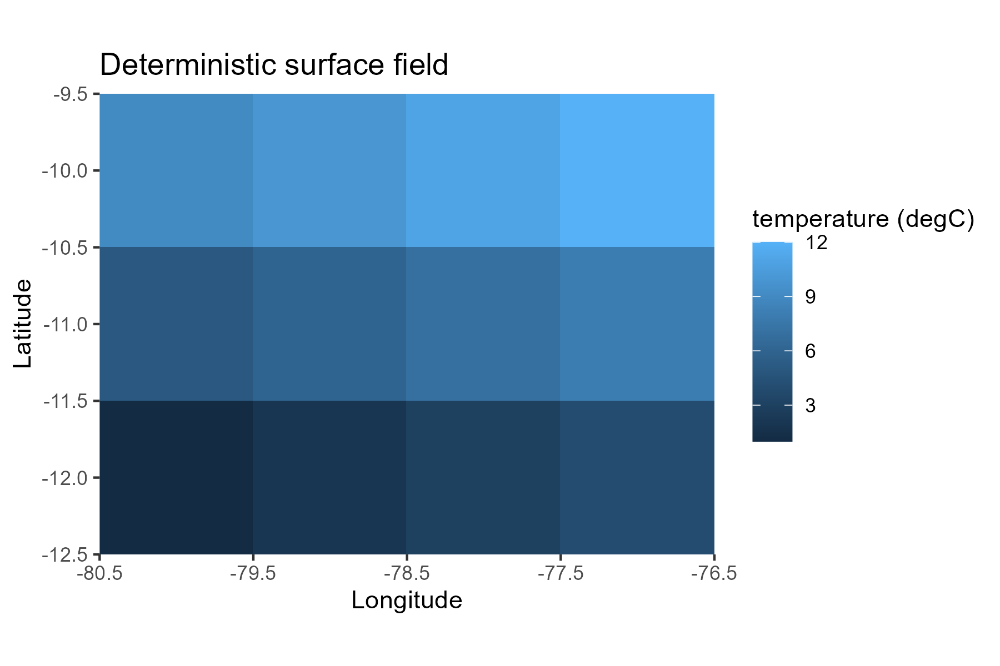
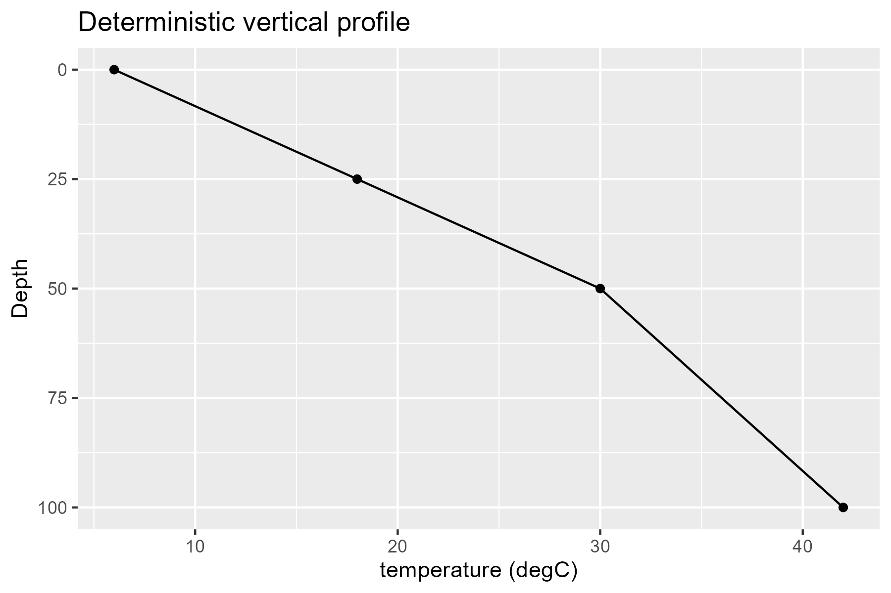
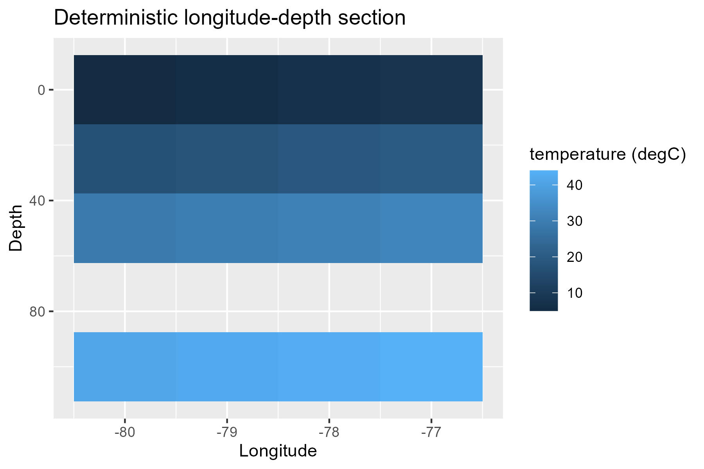
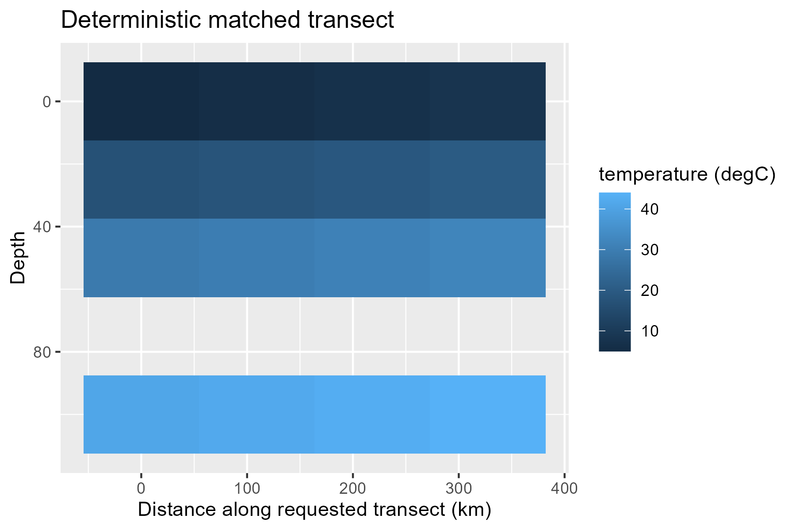
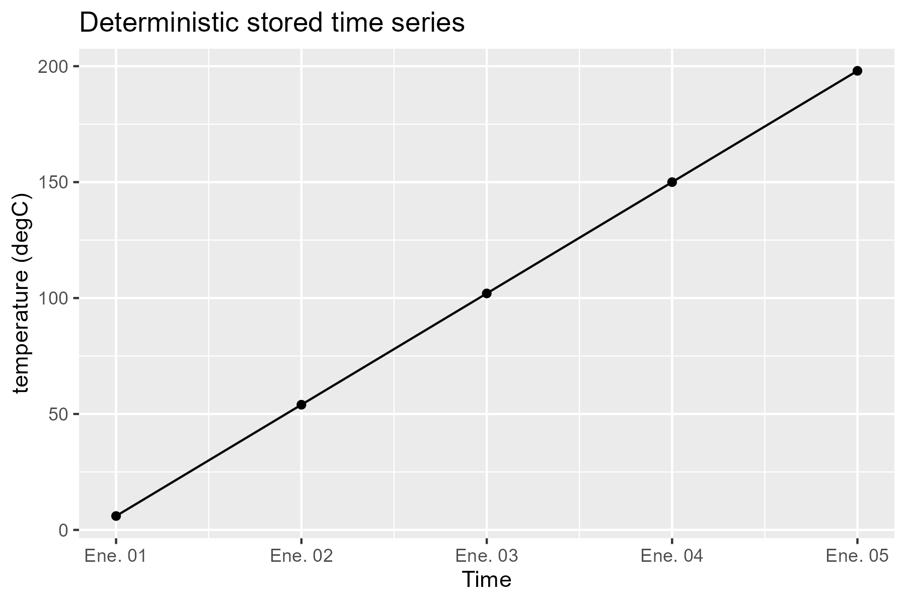
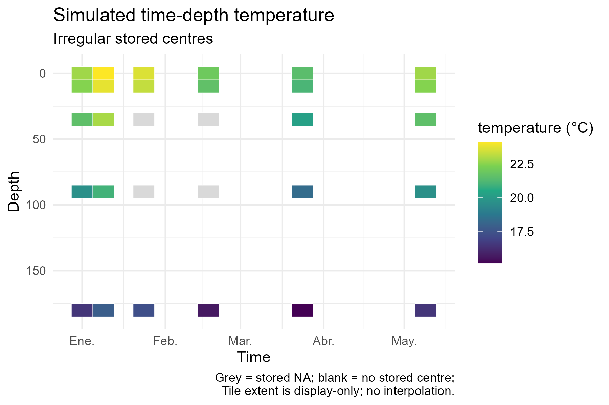
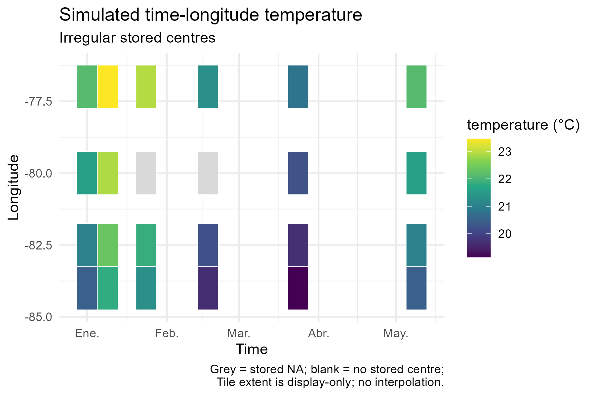
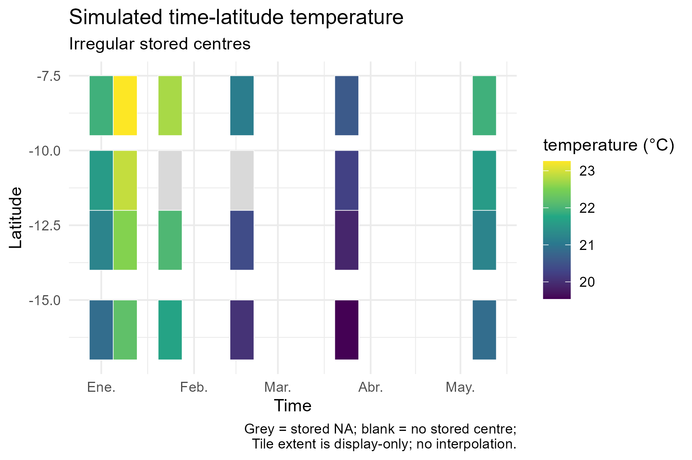

# Governed Phase-D visualization gallery

This repository-only gallery defines the certification surface for Phase-D
visualization implementations. D1A created the governance scaffold; D1B adds
five deterministic, network-free baseline graphics for the existing public
API without adding a visualization capability or intentional appearance
change.

Future layout:

```text
dev/gallery/visualization/
├── README.md
├── manifest.csv
├── scripts/
├── static/
├── interactive/
├── animation/
└── 3d/
```

Every implemented capability must have at least one deterministic, network-free
example built from governed fixtures or a small simulated cube. The manifest
must identify the scientific input, renderer, script, output and human reviewer.
A capability is not certified until the gallery artifact has been visually
inspected. Automated checks have three separate layers: scientific-data tests,
return-object contract tests, and visual regression tests. A screenshot or
`vdiffr` snapshot never substitutes for numerical scientific assertions.

Static publication examples should use PNG and, when appropriate, SVG or PDF;
interactive views use bounded HTML; animation uses a short GIF, compressed MP4,
or representative frames; 3-D uses a deterministic screenshot and optionally a
bounded HTML scene. Record dimensions, DPI, fonts, scale/legend behavior,
missingness, source semantics, projection, and accessibility observations.

Soft repository limits per artifact are 2 MiB for PNG/SVG/PDF, 5 MiB for HTML,
5 MiB for GIF, and 10 MiB for MP4. An exception needs explicit review. Prefer
short previews, a representative frame, compressed video, and generated-on-
demand full galleries over committing large binaries. External tiles, imagery,
coastlines, or bathymetry must never be fetched during gallery rendering.

The D1B scripts load an installed `oceancube` package, construct the governed
`d1b-gallery-deterministic-v1` cube with public APIs, call only public `viz.*`
functions, and save 1800 x 1200 PNG output at 300 dpi. Their manifest status is
`GENERATED_BASELINE_PENDING_MAINTAINER`. Pending review does not block the D1B
internal refactor, but a maintainer must review these baselines before D2 makes
any intentional appearance change.

## D1B baseline

### Map



### Profile



### Section



### Transect



### Time series



## D2A candidates — maintainer review required

These figures were generated from the installed public `viz.hovmoller()` API
and deterministic simulated data. They are technically validated but have not
been visually approved. A grey tile is a stored centre whose value is `NA`; a
blank region has no stored centre and therefore no tile or boundary. Tile
extent is a display-only footprint derived from stored-centre spacing when
authoritative bounds are unavailable. No value is interpolated, averaged,
smoothed, or filled.

### Hovmöller time-depth



### Hovmöller time-longitude



### Hovmöller time-latitude



For each candidate, record the named maintainer decision against the checklist
in `../../visualization/d2a/d2a-visual-review-checklist.csv`. Until then all
three manifest rows remain `REGENERATED_PENDING_MAINTAINER`.
