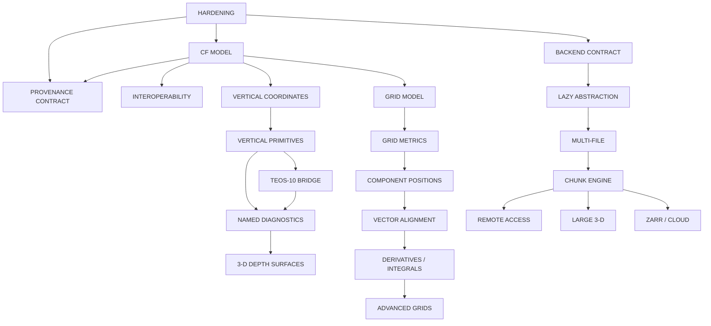

# Status and authority

This is the canonical design gate for oceancube development after the stable
0.2.0 release. It records architecture, provenance, dependencies, uncertainty,
and approval state; it does not authorize implementation by itself. The runtime
baseline remains version 0.2.0 with 38 exports.

The historical `oceancube-v0.2.0-scope.Rmd`, the 0.2.0 audit and decision
tables, relocation records, and auxdata review remain immutable evidence. They
are not current API commitments. Where historical proposals conflict with the
released source, tests, documentation, or `roadmap-decisions.csv`, the released
contract and the newer decision record prevail.

# Canonical architecture

The package owns the path from a source field to a valid, interpretable,
transformable, and exportable ocean field:

```text
RAW / REMOTE OCEAN DATA
        ↓
I/O + METADATA
        ↓
VALID OCEAN CUBE
        ↓
FIELD TRANSFORMATION
        ↓
PHYSICAL / GEOMETRIC FIELD
        ↓
VISUALIZATION / EXPORT
```

Its normal transformations are `field → field`, `field → profile`, `field →
section`, `field → surface`, `field → physical diagnostic`, and `field →
visualization`. It owns NetCDF and future storage backends, CF interpretation,
coordinates, grid and depth semantics, vertical ocean primitives, physical
diagnostics, regridding, lazy execution, and 2-D/3-D visualization. This role
does not imply that every capability needs a new public function.

## Boundary with spatind

`spatind` begins after a spatial or temporal field has been prepared. It owns
indicator construction, indicator series, uncertainty and inference, Sen slope
and Mann-Kendall analysis of indicators, breakpoints, regimes, and ecological
interpretation. Occupied area or volume, centre of gravity, dispersion,
inertia, Gini, entropy, quantile limits, hotspots and persistence,
fragmentation, overlap, habitat compression, and distribution shift therefore
belong downstream.

`annual_index()` is legacy boundary debt because it produces indicators and an
`ocean_indicators` object. It is neither deprecated nor moved until a tested
downstream replacement exists. `stock_mask()`, `crop_stock()`, `link_events()`,
and `signal_noise()` require individual boundary review; their names alone do
not authorize migration.

`cube_trend()` has a final contract in oceancube: descriptive per-cell ordinary
linear slope against actual elapsed time. Sen slopes, Mann-Kendall tests,
p-values, significance, breakpoints, and regimes are excluded.

# Provenance methodology

`roadmap-provenance.csv` is the machine-readable source. Each row is a bounded
work package, not necessarily a future export. Origin categories may be
combined from `INTERNAL`, `USER-DRIVEN`, `EXTERNAL-INSPIRED`,
`STANDARD-DRIVEN`, and `ARCHITECTURAL`. Allowed item states are `PROPOSED`,
`APPROVED-CONCEPT`, `DEFERRED`, `LEGACY-DEBT`, `OUT-OF-SCOPE`, and
`MOVED-TO-SPATIND`.

Priority means:

| Priority | Meaning |
|---|---|
| P0 | Contract, measurement, or dependency gate; blocks later architecture |
| P1 | Next-release core after its gates are satisfied |
| P2 | Valuable extension with bounded dependencies |
| P3 | Large-scale or advanced work requiring major infrastructure |
| P4 | Long-horizon, uncertain, or explicitly out-of-scope work |

`APPROVED-CONCEPT` approves direction and ordering, not a function name,
scientific formula, dependency addition, or implementation. Candidate names in
the provenance table are deliberately marked as proposed APIs.

# Canonical version stages

| Stage | Canonical objective | Exit evidence |
|---|---|---|
| 0.2.0 foundation | Stable cube, memory/local NetCDF behavior, extraction, visualization, temporal engines, geometry, and release documentation | Released and certified |
| Post-release | GitHub Release, pkgdown root, Quarto handbook, CI, Pages, and release audit | Completed |
| 0.3.0-A hardening | Real-data fixtures, backend parity, coverage, properties/invariants, benchmarks, memory and stress baselines, public lazy-entry review, minimal provenance schema | Gate A and hardening exit review |
| 0.3.0-B CF + interoperability | Staged CF model, calendars, conformance, optional stars/terra/sf/tidy adapters, versioned spatind exchange | CF model and adapter contracts approved |
| 0.3.0-C vertical ocean | Vertical coordinate contract, primitives, gsw bridge, then separately reviewed named diagnostics | Gate B |
| 0.3.0-D ocean visualization | Hovmöller, T-S, renderer-neutral surfaces/slices and small/medium isosurfaces | Gate C |
| 0.3.0-E vector ocean | Component recognition, positions, speed/direction, alignment, vertical velocity | Grid-position contract available |
| 0.4.0-A grid operations | `ocean_grid` topology, metrics, interpolation, regridding, derivatives, integrals, weighting, boundaries | Gate D |
| 0.4.0-B advanced grids | Curvilinear, rotated, staggered, sigma/hybrid coordinates and stronger antimeridian behavior | Core grid evidence complete |
| 0.4.0-C multi-file / remote | Compatibility, virtual collections, time concatenation, OPeNDAP/THREDDS, remote provenance | Backend and CF contracts stable |
| 0.5.0-A lazy compute | Operation DAG, deferred execution, chunk planner, estimator, cache, progress, and bounded parallel execution | Lazy and chunk contracts stable |
| 0.5.0-B storage + large 3-D | CF NetCDF writing, encoding, experimental Zarr/cloud, large rendering and animation | Gate E and scale benchmarks |
| 0.6.x extended models | Profiles, trajectories, ensembles, discrete sampling geometries, and possible unstructured grids | Per-model contracts and fixtures |
| 1.0.0 | Stable scientific and interoperability contracts | Provisional acceptance criteria satisfied |

# Dependency DAG



The important corrections are that vertical semantics precede named
diagnostics, grid positions precede vector calculus, and lazy/chunk/storage
abstractions precede Zarr and large-volume rendering.

# Implementation gates

## Gate A — begin the 0.3 development cycle

**Status: SATISFIED on 2026-08-20.** The canonical roadmap and 0.3.0-A
hardening scope are approved, `main` remains the stable/post-release integration
branch, `dev-0.3.0` is active, and the development version is `0.2.0.9000` toward
the intended 0.3.0 release.

Requires approval of this roadmap, the 0.3.0-A hardening scope, and the
branch/version strategy. The measurement framework must exist before major
feature expansion, although every performance optimization need not be done.

## Gate B — begin vertical science

Requires a sufficiently defined CF/vertical coordinate contract, redistributable
real-data depth fixtures, and approved vertical primitive semantics. Every named
diagnostic then requires a separate methodological review; this roadmap does
not select final formulas.

## Gate C — begin 3-D

Requires a renderer-neutral surface data contract, positive-down display
semantics, a decimation and memory policy, and renderer evaluation. Depth
surfaces, slices, contextual sections, and small/medium isosurfaces are P1/P2.
Large voxels, volume rendering, large isosurfaces, and long animations are P3
and wait for the chunk engine.

## Gate D — begin advanced grids

Requires an `ocean_grid` contract, CF grid mapping, topology and position
semantics, and metric design. Vector calculus cannot precede this gate.

## Gate E — begin cloud/Zarr

Requires a lazy backend abstraction, chunk model, writer/storage abstraction,
and CF encoding policy.

# Hardening and real-data validation

Hardening is a measurement phase: real-data validation, memory/NetCDF backend
parity, property and invariance tests, coverage audit, benchmarks, memory
profiles, stress tests, and fixture governance. It also reviews the public
lazy-NetCDF entry. `read_nc()` remains materializing until decision `DEC-018`
is resolved; a candidate `cube_open()` name is not an approved API.

**0.3.0-A1 status (2026-08-20): baseline completed.** The bounded audit records
the existing test architecture, 90.3872% local line coverage, backend/read
evidence, deterministic TINY/SMALL timing and allocation observations,
real-data governance, lazy-I/O decision evidence, and provenance gaps under
`dev/hardening/`. It found no S0 blocker. This completes A1 measurement and
design only; it does not complete 0.3.0-A or approve an API/remediation.

**0.3.0-A2 status (2026-08-20): contract strengthening completed.** Deterministic
valid-cube generators and P1-P8 property/invariance tests now cover singleton
axes, structured missingness, Date/POSIXct and irregular time; direct common
validation and all-five-visualization memory/NetCDF parity are explicit; and
supported packed-NetCDF/time plus mocked connection/download contracts are
strengthened without runtime, API, dependency, Python-environment, provider-data
or network changes. A1-006, A1-007 and A1-008 are closed; A1-001 and A1-002 are
partially closed because external integration and additional internal branches
remain intentionally bounded. This does not complete 0.3.0-A or satisfy Gate B.

**0.3.0-A3a status (2026-08-20): real-data governance and source-selection
evidence completed.** First-party legal/access and metadata evidence now supports
a maintainer decision on OISST v2.1, ETOPO 2022 and WOA23 as an orthogonal
surface/time, bathymetry and vertical suite; MUR and GEBCO are documented
alternates. The Copernicus case remains maintainer-only, no provider binary was
downloaded or committed, `A1-005` is partially closed, and `A1-010` and
`DEC-024` remain open. A3b fixture creation requires explicit product approval;
this does not complete 0.3.0-A or satisfy Gate B.

**0.3.0-A3b status (2026-08-21): governed fixture derivation and offline-CI
evidence completed.** The exact maintainer-approved OISST v2.1, ETOPO 2022 v1
and WOA23 v3.3 subsets are committed with deterministic scripts, source/final
SHA-256, attribution, 1,333,084 combined bytes and byte-identical second runs.
OISST executes current read/validation/selection/extraction/aggregation
contracts; ETOPO static time absence and WOA native climatological `months
since` encoding are preserved as expected current limitations. REAL-DATA test
taxonomy is non-zero, `A1-010` is closed and `DEC-024` is approved for this
exact source set. `A1-005` remains partially closed because Copernicus
redistribution is unknown. This does not complete 0.3.0-A or satisfy Gate B.

**0.3.0-A4a status (2026-08-21): versioned provenance architecture and
compatibility contract completed.** The source audit now covers 21 producing
paths and measures recursive/branching growth on the governed OISST fixture.
Schema V1 selects a flat ordered primary history plus a flat secondary-lineage
registry with deterministic local references, portable source identity,
source/current time semantics, bounded operation records, lossless hybrid
legacy migration, and explicit separation from QA and CF metadata. At the A4a
close, `A1-003` was partially closed because runtime helpers and tests did not
yet exist; the A4b1 entry below records their subsequent implementation.
`DEC-019` remains approved. This does not complete 0.3.0-A or satisfy Gate B.

**0.3.0-A4b1 status (2026-08-21): provenance V1 core engine and legacy
normalization completed.** The internal engine now validates and normalizes V1,
appends deterministic operations, flattens and reuses secondary lineages,
projects semantic equality, resolves package versions, and rejects unsafe or
secret-bearing canonical values. Current producers intentionally continue to
emit legacy shapes; A4b2 is the next integration phase. `A1-003` remains
partially closed and `DEC-019` remains approved. This does not complete 0.3.0-A
or satisfy Gate B.

**0.3.0-A4b2 status (2026-08-21): core runtime provenance migration
completed.** Construction, materialized and deferred NetCDF ingestion, slice,
crop, NetCDF-to-memory collect, and mask now emit flat V1 histories. Memory
collect remains a no-op. Legacy, V1, NULL, and safe opaque inputs are supported
without mutation; read/index diagnostics remain under QA. Complex temporal,
multi-input, table/geometry, and wrapper producers remain legacy for A4b3, with
a narrow compatibility bridge that preserves and later normalizes a V1 primary
parent without lineage loss. `A1-003` remains partially closed and `DEC-019`
remains approved. This does not complete 0.3.0-A or satisfy Gate B.

**0.3.0-A4b3a status (2026-08-26): temporal and multi-input provenance
migration completed.** Aggregate, climatology, anomaly, signal/noise, and trend
now append canonical V1 records. Anomaly registers one role-labelled secondary
climatology lineage, temporal wrappers do not duplicate delegated operations,
and historical/recurring/trend-anchor transitions are executable contracts.
The remaining legacy producers are `cube_extract`, `cube_transect`,
`cube_polygon_weights`, `layer_mean`, `coast_dist`, and `crop_stock`, deferred
to A4b3b. `A1-003` remains partially closed and `DEC-019` remains approved.
This does not complete 0.3.0-A or satisfy Gate B.

**0.3.0-A4b3b status (2026-08-26): table, geometry and remaining runtime
producer migration completed.** Extraction, transect, polygon weights, layer
mean, coast distance, and stock crop now append the same canonical V1 schema.
Table QA is separated under an internal attribute; the polygon legacy attribute
is retained as an exact compatibility alias. The final runtime scan has zero
active legacy producers. `A1-003` remains partially closed and `DEC-019`
remains approved because A4-EXIT global certification is still pending. This
does not complete 0.3.0-A or satisfy Gate B.

**0.3.0-A4-EXIT status (2026-08-26): Provenance V1 globally certified and A4
closed.** The exhaustive producer scan finds zero active legacy producers; all
seven output families use the canonical V1 shape; migration, multi-input
lineage, serialization, semantic determinism, privacy, offline OISST lineage,
QA/CF separation, backend parity, and scientific regressions are executable
contracts. `A1-003` is closed and `DEC-019` remains approved with status
IMPLEMENTED/CERTIFIED. `A4B3B-001` remains open: it does not block A4 closure,
but its dependence on caller-global s2 state blocks the 0.3.0-A hardening exit.
0.3.0-A remains incomplete and Gate B remains unsatisfied.

**0.3.0-A4R status (2026-08-26): coast-distance reproducibility contract
completed.** A deterministic spherical-versus-ellipsoidal comparison found
measurable but non-pathological differences, and `coast_dist()` now uses the
existing locally controlled S2 helper. Caller state is restored on success and
error; initial S2 TRUE/FALSE states produce identical distance output and
semantic V1 provenance; the normal S2=TRUE result is preserved. The canonical
method is `oceancube:s2_coast_distance` version 1 and `A4B3B-001` is closed.
The polygon-interior zero-distance ambiguity is retained as non-blocking S3
finding `A4R-001`. 0.3.0-A remains incomplete and Gate B remains unsatisfied;
A5 is next.

No large provider product is added to Git. Proposed source classes are:

| Source class | Contract evidence | Access and fixture policy | CI-safe form |
|---|---|---|---|
| Copernicus Marine physical model | depth, multiple variables, masks, calendars, real NetCDF metadata | authenticated/licensed access review; checksum-derived tiny subset | only an approved redistributable subset or synthetic analogue |
| NOAA gridded product | conventional rectilinear surface/time field | public-source attribution and version pinning | tiny pinned subset |
| Satellite SST | singleton depth, quality and missingness | provider redistribution and flag review | tiny quality-bearing subset |
| Satellite chlorophyll | packed values, quality, skew and missingness | provider terms and transformation record | tiny derived subset if permitted |
| Reanalysis forcing | long time axes, cell methods, multi-file compatibility | provider terms and stable product version | metadata fixture plus tiny subset |
| Bathymetry | depth orientation, units, bounds and overlays | source/license attribution and resolution limit | coarse redistributable subset |
| Nontrivial ocean-model grid | auxiliary coordinates, topology and eventual stagger/sigma behavior | access and grid-specific method review | metadata/topology fixture before any data payload |

Each fixture needs source identity, license/access decision, derivation script,
checksum, tested contract, size budget, and explicit CI eligibility.

# CF, calendars, and interoperability

CF is P0 architecture and is staged rather than claimed all at once:

1. preserve metadata;
2. interpret coordinates and semantics;
3. validate conformance;
4. support advanced grids and vertical coordinates;
5. write CF-compliant data.

The model covers `standard_name`, `long_name`, `units`, `coordinates`, `axis`,
`positive`, `bounds`, `cell_methods`, `cell_measures`, `grid_mapping`,
`ancillary_variables`, `flag_values`, `flag_masks`, calendars, and formula
terms. `ncdfCF` is
an adapter/reference implementation and possible conformance oracle, not an
automatic internal engine.

Current standard, Gregorian, and proleptic-Gregorian behavior remains. Julian,
`noleap`/`365_day`, `all_leap`/`366_day`, and `360_day` belong to the CF engine
and require decision `DEC-023`; they are not isolated date helpers.

`stars` is the principal optional N-D/geospatial adapter candidate, `terra`
serves raster/surface interoperability, and `sf` remains vector geometry and
domain interoperability. Plain data-frame/tidy exchange is required for stable
keys and tabular consumers. None replaces `ocean_cube`.

# Vertical ocean and named diagnostics

The required order is:

```text
vertical coordinate semantics
        ↓
vertical primitives
        ↓
TEOS-10 where needed
        ↓
named diagnostics
        ↓
3-D depth surfaces
```

Primitives cover gradients, integration, means, interpolation, extrema, and
depth-at-value with explicit units, orientation, bounds, missingness, masks,
and tie rules. oce provides profile/section/T-S workflow evidence. gsw owns
TEOS-10 equations; oceancube aligns variables, validates units, derives or
checks pressure/depth inputs, dispatches by profile, restores cube structure,
and records provenance.

Thermocline, mixed-layer depth, pycnocline, halocline, oxycline, isotherm depth,
and isopycnal depth remain proposals. Each needs a separate scientific method
review before implementation.

# Visualization

Hovmöller and T-S plots extend current 2-D visualization. OceanView contributes
transect, sigma-to-depth, remapping, vector/quiver, and moving-slice concepts.
The user-driven 3-D requirement includes depth-dependent thermocline, MLD,
isotherm, isopycnal, oxycline, and bathymetry surfaces. ggcube contributes
surface, contour, voxel, lighting, orbit, animation, and face-projection ideas;
rgl contributes interactive OpenGL/WebGL and mesh primitives.

The scientific data preparation contract remains renderer-independent. Small
and medium surfaces/slices may enter 0.3.x after Gate C. Large volumetric work
waits until 0.5.x.

# Vector and grid operations

The grid sequence is topology → metrics → center/face positions → interpolation
→ vector alignment → derivatives/integrals → advanced diagnostics. xgcm is the
principal architectural reference for this ordering, not a dependency. Future
work includes curvilinear and rotated grids, Arakawa staggering, sigma/hybrid
coordinates, sigma-to-depth, conservative remapping, and antimeridian rules.

Vector recognition (`u`, `v`, and optional `w`), speed, direction, component
alignment, and vertical velocity depend on position semantics. Proposed API
names remain candidates.

# Backends, lazy execution, and storage

The current internal NetCDF descriptor and bounded-read planner are the local
foundation. tidync is an extraction/introspection reference and possible test
oracle. xarray informs labeled dataset/backend separation and multi-file
compatibility; Dask informs chunk planning and task-graph costs. Neither creates
a Python core dependency and oceancube must not mechanically copy the xarray
API.

Multi-file compatibility and provenance precede concatenation. A lazy operation
DAG, deferred execution, memory estimator, cache/progress model, and bounded
parallel execution precede remote/cloud scale. Zarr is a future storage backend;
kerchunk is a future reference-dataset concept. Both require CF, backend, lazy,
chunk, storage, and provenance gates. Before remote I/O expands, provider-specific data
acquisition adapters must be evaluated; Copernicus behavior is not assumed to
be a universal provider contract. This records an architecture requirement only
and approves no API name or runtime implementation.
CF-compliant NetCDF writing precedes or shares
the storage-encoding gate.

# Versioned oceancube-to-spatind exchange

The current plain weight table and stable cell indices are the starting point.
The 0.3.0-B work package defines schema version, keys, dimensions, units,
coordinate and bounds semantics, missingness, provenance linkage, and backward
compatibility. It does not pass a live cube backend or `sf` geometry and does
not invent a downstream API before the spatind contract is available.

# Open development decisions

The public lazy-NetCDF entry, native versus hybrid CF engine, adapter direction,
3-D renderer, non-Gregorian representation, and spatind dependency depth remain
open. Exact OISST/ETOPO/WOA23 fixture governance is approved by DEC-024; future
sources require a new product-specific review.

The semantic recommendation for the next development cycle is `0.2.0.9000`:
it denotes development immediately after released 0.2.0 while 0.3.0 remains the
next formal release. This is a recommendation, not a version change. The fully
merged `dev-0.2.0` branch should be deleted only when branch policy is approved;
`dev-0.3.0` should be created only when development actually begins.

# Technical debt register

| Debt | Classification | Required future action |
|---|---|---|
| `annual_index()` produces indicators | Legacy boundary debt | Keep compatible until spatind replacement and migration approval |
| `stock_mask()`, `crop_stock()`, `link_events()` | Boundary review | Review semantics and consumers individually |
| `signal_noise()` name | Naming ambiguity | Preserve behavior; review naming without assuming deprecation |
| Historical documents describe outdated release/API status | Documentation debt | Add status notices only in a separate approved consolidation phase |
| Deferred NetCDF backend has no public entry | P0 architecture debt | Resolve `DEC-018` after parity evidence |
| Provenance has no versioned schema | P0 architecture debt | Define minimal 0.3.0-A contract |
| Pages uses `actions/checkout@v4` while checks use v5 | Low-risk infrastructure debt | Upgrade in a separate workflow maintenance phase |
| Handbook/vignette/legacy Rmd surfaces overlap | Documentation debt | Preserve; consolidate only after parity approval |
| GitHub license is `NOASSERTION` | Repository hygiene | Verify complete MIT metadata and GitHub recognition |
| GitHub description, homepage, and topics are empty | Repository hygiene | Populate separately from scientific development |
| `dev/architecture/netcdf-backend-contract.md` is historically stale | Architecture documentation debt | Reconcile with implemented internal backend without changing runtime |

# Superseded and out-of-scope ideas

The approximately 114 historical proposals are provenance evidence, not 114
future exports. The historical Theil-Sen option for a cube slope is superseded
by the final `cube_trend()` contract. Historical names such as
`cube_thermocline()`, `cube_mixed_layer_depth()`, `viz.surface3d()`,
`cube_regrid()`, or `cube_open_collection()` are candidate names only.

Ecological indicators and indicator inference move to spatind. Stock assessment,
species/community models, machine learning, causal inference, and general
Lagrangian particle tracking are outside the core package roadmap.

# Provisional 1.0.0 acceptance criteria

1. Stable `ocean_cube`, metadata/CF, backend, time, depth/vertical, grid,
   provenance, interoperability, and oceancube-to-spatind exchange contracts.
2. Documented backward-compatibility and lifecycle policy.
3. Real-data validation across representative surface, depth, quality, time,
   and grid products without embedding large operational data.
4. Reproducible performance, memory, and backend-parity baselines.
5. Multi-platform CI and reproducible pkgdown/handbook publication.
6. Evidence-based release acceptance independent of the number of exports.

# External architectural references

## Standards

- [CF Metadata Conventions 1.13](https://cfconventions.org/Data/cf-conventions/cf-conventions-1.13/cf-conventions.html)
- [Zarr](https://zarr.dev/) and the [Zarr v3 core specification](https://zarr-specs.readthedocs.io/en/latest/v3/core/index.html)

## R ecosystem

- [OceanView reference](https://search.r-project.org/CRAN/refmans/OceanView/help/remap.html)
- [ggcube](https://matthewkling.github.io/ggcube/)
- [oce](https://dankelley.github.io/oce/)
- [GSW-R / TEOS-10](https://teos-10.github.io/GSW-R/)
- [stars](https://r-spatial.github.io/stars/)
- [terra](https://rspatial.github.io/terra/)
- [sf](https://r-spatial.github.io/sf/)
- [ncdfCF](https://cran.r-project.org/package=ncdfCF)
- [CFtime](https://cran.r-project.org/package=CFtime)
- [tidync](https://docs.ropensci.org/tidync/)
- [rgl](https://dmurdoch.github.io/rgl/)

## Python and global data-cube ecosystem

- [xarray](https://docs.xarray.dev/en/stable/)
- [Dask Array](https://docs.dask.org/en/stable/array.html)
- [kerchunk](https://fsspec.github.io/kerchunk/)

## Ocean model grid systems

- [xgcm](https://xgcm.readthedocs.io/en/latest/)

## 3-D visualization

- [ggcube surface architecture](https://matthewkling.github.io/ggcube/articles/surfaces.html)
- [rgl OpenGL/WebGL architecture](https://dmurdoch.github.io/rgl/)

# Next gate

Gate A is satisfied and the 0.3 development cycle is open. A1/A2/A3a/A3b, the
complete A4 sequence through A4-EXIT, and A4R have evidence; A4 is closed and
coast distance is reproducible. The single recommended next subphase is A5,
the public lazy-NetCDF API decision for `A1-004`/`DEC-018`. 0.3.0-A remains
incomplete and Gate B remains unsatisfied. This placement does not authorize
CF, vertical, provider, 3-D, or A5 runtime implementation.
