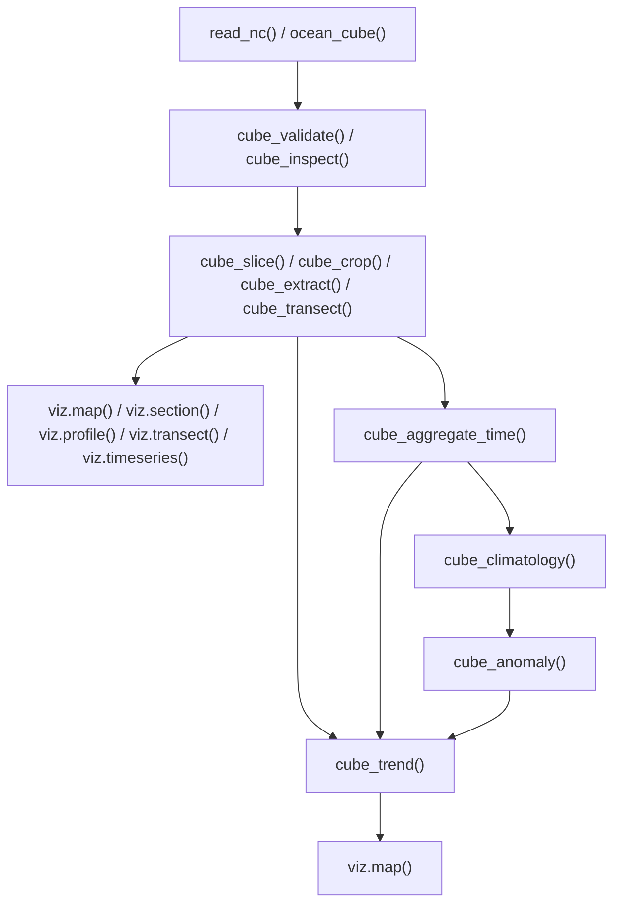

# Integrated workflows

Begin every new workflow with a supported constructor or local reader, then
validate and inspect before scientific selection. The scripts in
`handbook/scripts/` retain established executable patterns; the canonical
0.2.0 routes are summarized here.



## Workflow A: inspect, crop, and map

```text
local NetCDF -> read_nc() -> cube_validate() -> cube_inspect()
             -> cube_crop() -> viz.map()
```

`viz.map()` reads only the selected layer from a lazy NetCDF input and returns
a `ggplot` object. Validation never repairs coordinates, and inspection only
reads a full lazy payload when `missing = "full"` is explicitly requested.

## Workflow B: aggregate, climatology, and anomaly

```text
historical cube -> cube_aggregate_time() -> cube_climatology()
                -> cube_anomaly()
```

The climatology replaces historical time with a recurring reference cycle.
Difference and standardized anomalies match source observations to that cycle
using exact coordinates, variables, units, calendar, and time class.

## Workflow C: descriptive trend and map

```text
historical cube -> optional cube_aggregate_time() -> cube_trend() -> viz.map()
```

Raw, aggregated, anomaly, and `signal_noise()` cubes retain historical time and
may enter `cube_trend()`. A `cube_climatology()` result has recurring
pseudo-time and is rejected. Trend diagnostics such as R2 are descriptive;
there is no significance inference, Sen slope, Mann--Kendall test, breakpoint,
or regime detection.

## Compatibility route

`to_month()`, `clim_day()`, `clim_month()`, `anom_diff()`, `anom_z()`, and
`signal_noise()` remain available for established workflows. The climatology
and anomaly wrappers delegate to the canonical engines. `signal_noise()` means
standardized climatological anomaly magnitude, `abs(z)`, by default or signed
`z` with `signed = TRUE`; it is not a generic signal-to-noise ratio.

Prepared values, geometry, and weights can continue downstream to `spatind`,
which owns spatial indicators, higher-level interpretation, uncertainty, and
structural or regime analysis.
