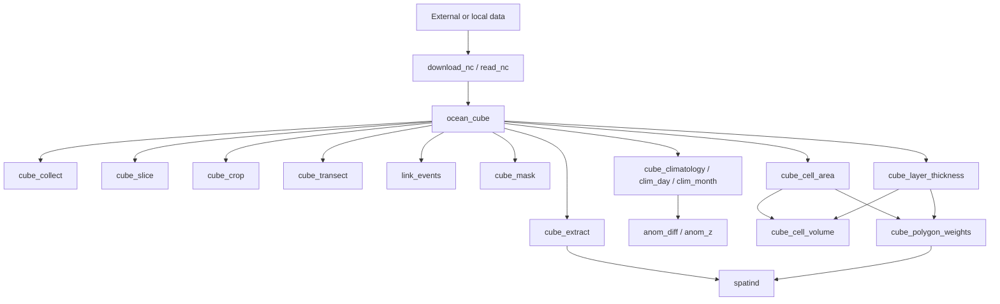

# Integrated workflows
Twelve executable patterns are represented by the scripts in `handbook/scripts/`: construct memory cubes; read NetCDF; slice; crop; extract series; extract profiles; transects; events; masks; climatology/anomalies; 3-D geometry; and preparation for `spatind`.

