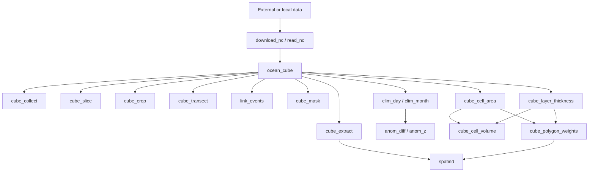

# Welcome
OceanCube Handbook is the executable guide to **oceancube 0.1.0**. It complements the Rd reference with concepts, decisions, workflows, and operational policy.

- Canonical contract: `longitude × latitude × depth × time × variable`
- Backends: in-memory and read-only local NetCDF
- Frozen public API: 27 exports
- Experimental in 0.x: `cube_transect()` and `cube_polygon_weights()`

Start with @sec-introduction, then use the workflow and function-reference chapters.
# Introduction {#sec-introduction}
`oceancube` gives ocean observations one validated five-dimensional shape while allowing storage to remain in memory or in a local NetCDF file. It solves a recurring problem: scientific operations should not depend on how values happen to be stored.

The package constructs, reads, selects, extracts, masks, summarises, and describes geometry. It deliberately does **not** calculate spatial indicators or inference; that responsibility belongs to `spatind`.

## Design goals
Reproducibility, explicit dimensions, read-only external data access, small composable operations, serialisable provenance, and stable outputs.
# Mental model
The logical cube always has five axes, including singleton axes. A surface field uses one depth position (often `NA`) rather than dropping depth. Variables form a logical fifth axis even when a NetCDF stores them as separate physical variables.

```text
ocean_cube
├── coordinates: longitude, latitude, depth, time, variable
├── metadata: units, extents, provenance, mask, QA
└── backend: memory | netcdf
```

A coordinate is a scientific value; an index is its integer position. Logical order is canonical; physical NetCDF order may differ and is translated by the backend. Missing values remain `NA`; units and provenance travel with derived cubes.
# The ocean_cube object
Create a memory cube from a five-dimensional array. Validation checks axis lengths, names, order, time values, units, and backend invariants.

```r
library(oceancube)
x <- ocean_cube(lon=c(-80,-79), lat=-12, depth=0,
  time=as.Date(c('2020-01-01','2020-02-01')), vars='temperature',
  data=array(1:4, dim=c(2,1,1,2,1)))
x
summary(x)
```

`cube_collect()` turns a lazy selection into an independent memory-backed cube. Serialisation preserves descriptors and provenance; a NetCDF descriptor still requires its unchanged source file until collected.
# Data access
`cm_setup()`, `cm_connect()`, and `download_nc()` coordinate optional Copernicus acquisition without storing credentials. `read_nc()` opens a **local, read-only** NetCDF descriptor. No OPeNDAP, THREDDS, cloud store, or write support is claimed.

A NetCDF backend validates file identity, maps physical axes to the canonical contract, and reads only requested blocks when possible. `cube_collect()` explicitly materialises values.
# Selection and extraction
| Function | Spatial selection | Temporal selection | Output |
|---|---|---|---|
| `cube_slice()` | discrete Cartesian product | discrete | cube |
| `cube_crop()` | rectangular intervals | interval | cube |
| `cube_extract()` | Cartesian product | discrete | table |
| `cube_transect()` | ordered spatial pairs | one time | table |
| `link_events()` | one match per row | one match per row | enriched table |

They are not interchangeable: slice/crop preserve cube semantics, extract/transect produce analytical tables, and event linkage preserves the original event rows.
# Masks and spatial context
`cube_crop()` reduces axes without changing retained values. `cube_mask()` preserves every axis and converts cells outside polygons to `NA` using cell-centre semantics. `cube_polygon_weights()` does not read cube values: it returns geometry intersections and fractions.

| Operation | Preserves all axes | Modifies values | Returns cube | Semantics |
|---|---:|---:|---:|---|
| crop | no | no | yes | domain reduction |
| mask | yes | yes (`NA`) | yes | cell centre |
| polygon weights | n/a | no values read | no | geometric fraction |

`stock_mask()`, `crop_stock()`, and `coast_dist()` preserve established spatial-context workflows.
# Time, climatology, and anomalies
`to_month()` aggregates time to months. `clim_month()` and `clim_day()` estimate reference means and variability. `anom_diff()` returns absolute departures, `anom_z()` standardised departures, and `signal_noise()` standardized climatological anomaly magnitude (`abs(z)`) by default or signed `z` on request. It is not a general signal-to-noise ratio. `annual_index()` and `layer_mean()` provide annual and vertical summaries.

Always inspect time coverage, missingness, sample counts, and units before interpreting climatology products.
# Grid geometry and weights
For rectilinear grids, `cube_cell_area()` returns horizontal area, `cube_layer_thickness()` derives vertical thickness, and `cube_cell_volume()` combines both. `cube_polygon_weights()` returns sparse intersections suitable for downstream aggregation.

CRS must be known and compatible. Curvilinear/unstructured grids and general antimeridian handling are outside 0.1.0. Polygon weights are experimental during the 0.x series.
# Public function reference
The 27 cards below use signatures extracted from the installed 0.1.0 namespace.

- [annual_index()`](functions/annual_index.qmd)
- [anom_diff()`](functions/anom_diff.qmd)
- [anom_z()`](functions/anom_z.qmd)
- [clim_day()`](functions/clim_day.qmd)
- [clim_month()`](functions/clim_month.qmd)
- [cm_connect()`](functions/cm_connect.qmd)
- [cm_setup()`](functions/cm_setup.qmd)
- [coast_dist()`](functions/coast_dist.qmd)
- [crop_stock()`](functions/crop_stock.qmd)
- [cube_cell_area()`](functions/cube_cell_area.qmd)
- [cube_cell_volume()`](functions/cube_cell_volume.qmd)
- [cube_collect()`](functions/cube_collect.qmd)
- [cube_crop()`](functions/cube_crop.qmd)
- [cube_extract()`](functions/cube_extract.qmd)
- [cube_layer_thickness()`](functions/cube_layer_thickness.qmd)
- [cube_mask()`](functions/cube_mask.qmd)
- [cube_polygon_weights()`](functions/cube_polygon_weights.qmd)
- [cube_slice()`](functions/cube_slice.qmd)
- [cube_transect()`](functions/cube_transect.qmd)
- [download_nc()`](functions/download_nc.qmd)
- [layer_mean()`](functions/layer_mean.qmd)
- [link_events()`](functions/link_events.qmd)
- [ocean_cube()`](functions/ocean_cube.qmd)
- [read_nc()`](functions/read_nc.qmd)
- [signal_noise()`](functions/signal_noise.qmd)
- [stock_mask()`](functions/stock_mask.qmd)
- [to_month()`](functions/to_month.qmd)
# Integrated workflows
Twelve executable patterns are represented by the scripts in `handbook/scripts/`: construct memory cubes; read NetCDF; slice; crop; extract series; extract profiles; transects; events; masks; climatology/anomalies; 3-D geometry; and preparation for `spatind`.


# Boundary with spatind
## oceancube produces
Cubes, values, coordinates, indices, masks, areas, thicknesses, volumes, intersections, weights, units, and provenance.

## spatind will calculate
2-D and 3-D indicators, centres of gravity, occupied area/volume, dispersion, inertia, elongation, isotropy, concentration, Gini, patchiness, trends, uncertainty, regimes, and inference.

These are architectural responsibilities, not a claim that future `spatind` functions already exist.
# Git and release workflow
The persistent branch is `main`. Future `feature/*`, `fix/*`, `docs/*`, and `release/*` branches are temporary: create one objective per branch, test, merge or open a PR, then delete only after ancestry is verified.

Never force the history of `main`. Use annotated tags for versions and attach GitHub Releases to those tags. ‘Only main remains’ means completed work branches are removed; it does not forbid future branches.
# Troubleshooting
| Problem | Cause | Solution |
|---|---|---|
| array is not 5-D | dropped/missing axis | reshape with all five axes |
| missing axis or out-of-domain index | invalid selector | inspect coordinates and valid positions |
| coordinate/nearest outside tolerance | no valid match | widen tolerance deliberately or correct input |
| NetCDF missing or modified | descriptor source changed | restore the exact file or recreate descriptor |
| variable missing | mapping mismatch | inspect NetCDF variables |
| CRS missing/incompatible | geometry metadata absent | define/transform CRS explicitly |
| invalid geometry | topology error | validate with `sf` |
| antimeridian | unsupported geometry | split/normalise before use |
| depth bounds absent | thickness cannot be inferred safely | supply bounds |
| unknown units | metadata incomplete | assign verified units |
| polygon has no centres | cell-centre mask selects none | inspect polygon/grid |
| curvilinear grid | unsupported in 0.1.0 | regrid outside oceancube |
| materialisation too large | full cube exceeds memory | select/crop before collect |
| experimental function | 0.x evolution | pin version and test outputs |
| Quarto/HTML unavailable | toolchain/configuration | run `quarto check` and render locally |
| branch not integrated/deletion rejected | ancestry check fails | merge first; never use `-D` |
| tag already exists | version collision | inspect tag; never overwrite published tag |
# Cheat sheet
| Goal | Function |
|---|---|
| create cube | `ocean_cube()` |
| read NetCDF | `read_nc()` |
| materialise | `cube_collect()` |
| select coordinates | `cube_slice()` |
| crop domain | `cube_crop()` |
| extract table/profile/series | `cube_extract()` |
| transect/events | `cube_transect()` / `link_events()` |
| mask | `cube_mask()` |
| monthly/daily climatology | `clim_month()` / `clim_day()` |
| absolute/standard anomaly | `anom_diff()` / `anom_z()` |
| area/thickness/volume | `cube_cell_area()` / `cube_layer_thickness()` / `cube_cell_volume()` |
| polygon weights | `cube_polygon_weights()` |
| spatial indicators | `spatind` |

Other exports cover Copernicus setup/download, stock context, coast distance, vertical/annual summaries, and monthly aggregation. See the function cards for exact signatures.
